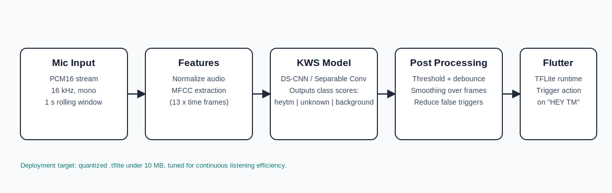
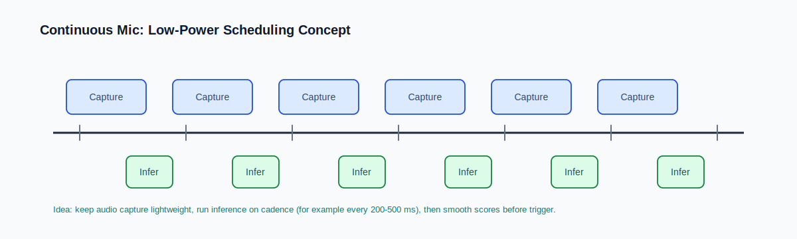

# HEY TM Keyword Spotting (KWS) for Flutter TFLite

This repository trains a compact keyword spotting model to detect **"HEY TM"** from short audio windows and deploy it as a **TensorFlow Lite (`.tflite`)** model for Flutter.

## Project Objective
- Detect the wake phrase `HEY TM` reliably.
- Export a deployment model in `.tflite` format.
- Keep model size around or below **10 MB** (smaller is better).
- Train only from the training dataset folder.
- Do not split training data into a test subset inside the script.
- Evaluate with the separate `test/` folder.

## Quick Analogy
Think of the model like a security guard at a door:
- The guard hears many voices and noises (background + unknown words).
- The guard is trained to react only to one passphrase: **HEY TM**.
- The guard should react fast but must avoid false alarms.
- The guard is on duty all day, so it must work efficiently to save battery and CPU.

## Technology Stack
- Python 3.x
- TensorFlow / Keras
- Librosa (audio loading + MFCC)
- NumPy
- scikit-learn (reports, confusion matrix)
- TensorFlow Lite conversion

## Model + Signal Pipeline
The training script (`main_preset_model.py`) follows this flow:



### Step-by-step
1. Capture/load audio at `16 kHz`.
2. Force fixed length (`1 second`) by trimming/padding.
3. Extract MFCC features (`n_mfcc=13`, `n_mels=40`, `n_fft=512`, `hop_length=160`).
4. Normalize features.
5. Classify with a compact DS-CNN style model (separable convolutions).
6. Output class probabilities for `heytm`, `unknown`, and `background`.
7. Export both float and quantized TFLite models.

## Why This Architecture
- **MFCC** compresses speech-relevant information and discards much of the raw waveform redundancy.
- **Depthwise separable convolutions** reduce multiply-accumulate operations and parameter count versus standard convolutions.
- **Quantization** reduces model size and often improves inference efficiency on edge devices.

## Continuous Listening and Battery Strategy
For real application usage (always-on microphone), use low-power inference scheduling and stable post-processing:



Recommended practice:
- Keep audio capture lightweight (PCM16 mono).
- Use rolling windows (for example 1 second) with overlap.
- Run inference on cadence (for example every 200-500 ms), not every raw sample.
- Apply score smoothing and debounce to reduce false triggers.
- Prefer quantized model (`KWS_scratch.tflite`) for deployment.
- Tune thresholds using `test/` results, not only training metrics.

## Dataset Layout
Training data is expected in `datasets/`.
If `datasets/` is missing, the script falls back to `dataset/`.

Training folder structure:
```text
datasets/
  heytm/
  unknown/
  _background_noise_/
```

External test folder:
```text
test/
  positive1.wav
  positive2.wav
  ...
```

## Class Mapping (Important)
Model outputs use this class order:
1. `heytm`
2. `unknown`
3. `background`

The `background` class is loaded from folder name `_background_noise_`.

## Training Behavior
- Uses full training dataset for training.
- No internal train/test split.
- Runs external test evaluation from `test/` after training.

## Run Training
```bash
python main_preset_model.py
```

## A/B Experiment: Scratch vs Transfer
Run both training pipelines, then compare with one protocol:

```bash
python main_preset_model.py
python transfer_model.py
python ab_experiment.py
```

Or run everything from one command:

```bash
python ab_experiment.py --run-training
```

A/B outputs:
- `ab_results.json` (full machine-readable comparison)
- `ab_summary.md` (human summary + winner decision)

Current comparison metrics (flat `test/` mode):
- Keyword recall on `positive*` samples.
- False trigger rate on non-positive samples.
- Weak-label accuracy from filename heuristic.
- Quantized model size (MB).

## Main Outputs
- `models_scratch/KWS_scratch.tflite` (quantized deployment model)
- `models_scratch/KWS_scratch_float.tflite` (float reference model)
- `models_scratch/KWS_scratch.h5`
- `models_transfer/KWS_mobilenet_transfer.tflite` (transfer quantized model)
- `models_transfer/KWS_mobilenet_transfer_float.tflite` (transfer float model)
- `training_log.txt`
- `training_log_transfer.txt`
- `test_predictions.json` (when `test/` has flat audio files)
- `test_predictions_transfer.json` (when `test/` has flat audio files)
- `test_results_detailed.json` + `confusion_matrix.png` (for labeled subfolder test mode)
- `test_results_transfer_detailed.json` + `confusion_matrix_transfer.png` (transfer labeled mode)

## Flutter Deployment Notes
- Use `tflite_flutter` (or equivalent) to load `KWS_scratch.tflite`.
- Feed audio features in the same format used during training.
- Keep preprocessing consistent across Python and Flutter runtime.
- Calibrate trigger threshold and smoothing in-device with real ambient noise.

## Flutter: PCM16 to Model Input
Use this implementation file:
- `docs/flutter/kws_audio_frontend.dart`

Copy this file into your Flutter app, for example:
- `lib/audio/kws_audio_frontend.dart`

Suggested Flutter packages:
- `tflite_flutter` for TFLite inference.
- `fftea` for FFT used in MFCC extraction.
- `record` (or your preferred mic package) to capture PCM16 audio.

### Example: run inference from PCM16 bytes
```dart
import 'dart:typed_data';
import 'package:tflite_flutter/tflite_flutter.dart';
import 'package:your_app/audio/kws_audio_frontend.dart';

class KwsRunner {
  late final Interpreter _interpreter;
  final KwsAudioFrontend _frontend = KwsAudioFrontend();
  static const labels = ['heytm', 'unknown', 'background'];

  Future<void> load() async {
    _interpreter = await Interpreter.fromAsset('KWS_scratch.tflite');
  }

  /// pcm16LeBytes must be mono PCM16 little-endian bytes.
  List<double> inferFromPcm16(Uint8List pcm16LeBytes) {
    final input = _frontend.pcm16BytesToInputTensor(pcm16LeBytes); // [1,101,13]
    final output = List.generate(1, (_) => List<double>.filled(3, 0.0));
    _interpreter.run(input, output);
    return output[0];
  }
}
```

### Output interpretation
- `scores[0]` => `heytm`
- `scores[1]` => `unknown`
- `scores[2]` => `background`

Use a threshold plus smoothing/debounce before triggering wake-word action.

## Practical Accuracy Tuning
If you need better real-world performance:
- Add more hard negative samples to `unknown/` (music, TV speech, office noise).
- Add varied microphone distances for `heytm/`.
- Add realistic background noise recordings.
- Compare multiple model widths/depths and keep the smallest model that meets accuracy target.
- Validate false accept / false reject behavior on long continuous recordings.

## Reference Files
- [Training script](main_preset_model.py)
- [Transfer script](transfer_model.py)
- [A/B compare script](ab_experiment.py)
- [A/B protocol](docs/ab_protocol.md)
- [Project objective](project.md)
- [Agent instructions](agent.md)
- [Flutter PCM16 frontend](docs/flutter/kws_audio_frontend.dart)
- [Pipeline diagram](docs/images/kws_pipeline.svg)
- [Continuous listening diagram](docs/images/continuous_listening.svg)
